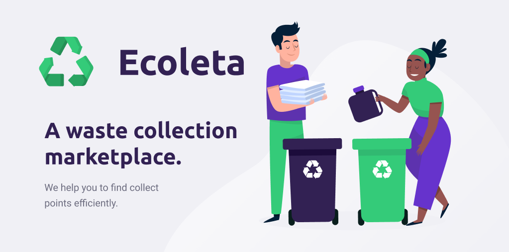

<h1 align="center">
  Ecoleta
</h1>

Your Waste Collection Marketplace.

  

  

  
  

## :computer: The Project

This initiative was started by [Rocketseat](https://github.com/Rocketseat) and inspired by the International Environment Week! Ecoleta is a waste collection manager where organizations will be able to create access points to certain types of waste products and users will be able to find the closest waste collector organization for their waste products and contact them either via e-mail or whatsapp via Ecoleta Mobile Application. Overall, the purpose of Ecoleta is to promote the reutilization of waste products in an easy and efficient way for everyone!

## :rocket: Technologies

The project was developed with the following technologies:

- [TypeScript](https://www.typescriptlang.org/)
- [Node.js](https://nodejs.org/en/)
- [ReactJS](https://reactjs.org)
- [React Native](https://facebook.github.io/react-native/)

## :electric_plug: Installation and Execution

Instructions can be found in each module's folder:

- [Backend](https://github.com/andre-silva-14/ecoleta/tree/master/server)
- [Web](https://github.com/andre-silva-14/ecoleta/tree/master/web)
- [Mobile](https://github.com/andre-silva-14/ecoleta/tree/master/mobile)

## :black_nib: Design

The design layout for the whole project can be found in [Figma](https://www.figma.com/file/yoccFn3TgFrzBbj6qWOiwF/Ecoleta).

## :memo: License

This project is under the MIT license. See [LICENSE](LICENSE) for more details.
