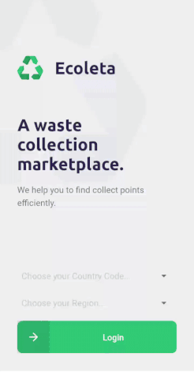

<h1 align="center">Mobile App</h1>

  

## Getting started...

First, clone the repository and install all the project dependencies:

    $ git clone https://github.com/andre-silva-14/ecoleta.git
    $ cd ecoleta/mobile
    $ npm install

Next, start the server which will trigger Expo start and open-up the expo dashboard in your browser:

    $ npm start

At this point you can use a mobile emulator or simply install [Expo](https://play.google.com/store/apps/details?id=host.exp.exponent&hl=en) on a mobile device and scan the QR Code.

Expo will set up the whole enviroment and build the JS Bundle natively.

Please note that at this point for a seamless experience you should have the API Server already running, check [here](https://github.com/andre-silva-14/ecoleta/tree/master/server) for instructions on how to run the API Server. ***Important!*** If you are running the app on your mobile device, it wont be able to reach the localhost from your computer 
where the API Server is running. For this reason, I recommend using [ngrok](https://ngrok.com/) to create a temporary public host tunnel for the localhost API and configure 
[this file](https://github.com/andre-silva-14/ecoleta/blob/master/mobile/src/services/api.ts) inserting here the ngrok API URL.