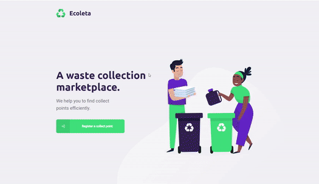

<h1 align="center">Website</h1>

  

## Getting started...

First, clone the repository and install all the project dependencies:

    $ git clone https://github.com/andre-silva-14/ecoleta.git
    $ cd ecoleta/web
    $ npm install

And now run the server:

    $ npm start

Now the Website is completely ready and listening on [http://localhost:3000/](http://localhost:3000/).

Please note that at this point and for a seamless experience you should have the API Server already running, check [here](https://github.com/andre-silva-14/ecoleta/tree/master/server) for instructions on how to run the API Server.